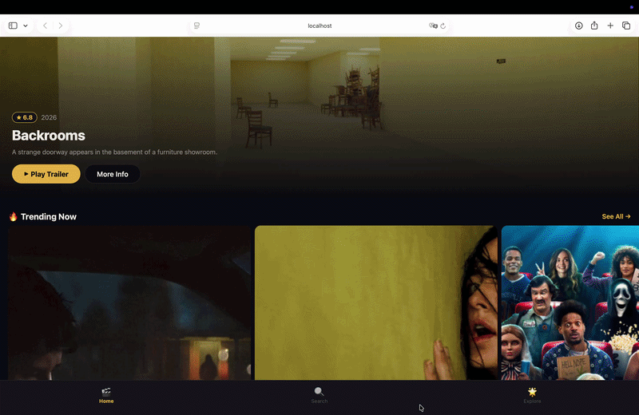

# 🎬 CineVault — Movie Browsing App

A React Native movie browsing application built for the GARS Technology internship assignment.

## Features
- 🔥 Trending, Top Rated, Upcoming, Now Playing categories
- 🎬 Hero section with featured movie & trailer button
- 🔍 Dynamic search with genre & year filters
- 📺 Inline YouTube trailer playback
- 📱 Cross-platform (iOS & Android)

## Tech Stack
- **Framework**: React Native (Expo SDK 51)
- **Navigation**: React Navigation v6 (Stack + Bottom Tabs)
- **Video Player**: react-native-youtube-iframe
- **Images**: expo-image (with caching)
- **API**: TMDB (The Movie Database)

## Setup

1. Clone the repo:
   git clone https://github.com/Christyjohntharakan/MovieApp.git
   cd MovieApp

2. Install dependencies:
   npx expo install

3. Create a `.env` file:
   EXPO_PUBLIC_TMDB_API_KEY=your_tmdb_api_key_here

4. Get your free TMDB API key at https://www.themoviedb.org/settings/api

5. Run:
   npx expo start

## Environment Variables
| Variable | Description |
|---|---|
| EXPO_PUBLIC_TMDB_API_KEY | Your TMDB v3 API key |

## Screen Recording

